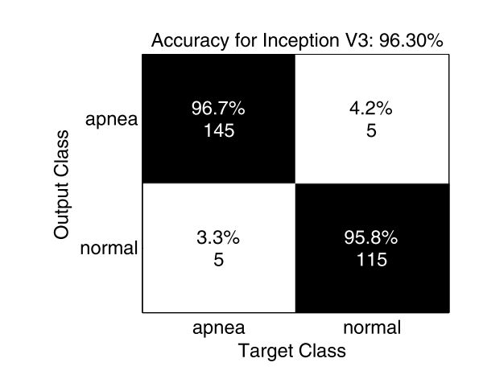
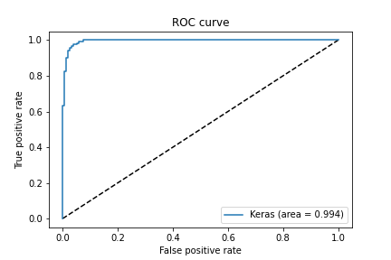

# Sleep-Apnea-ECG-Deep-Learning
Deep learning-based obstructive sleep apnea detection from ECG signals using recurrence plots and pretrained CNN architectures.

# Deep Learning-Based Sleep Apnea Detection Using Single-Lead ECG and Recurrence Plots

This repository contains the official implementation for the paper:
**"Sleep apnea detection from ECG signals using deep convolutional neural network structures"** published in *Evolving Systems*.

🔗 **Paper Link**: [Springer - Evolving Systems (DOI: 10.1007/s12530-022-09445-1)](https://link.springer.com/article/10.1007/s12530-022-09445-1)

---

## 📌 Overview

Sleep apnea is a common sleep disorder characterized by repeated pauses in breathing during sleep. This project proposes a non-invasive, automated framework for detecting obstructive sleep apnea from single-lead ECG signals. 

1. **Recurrence Plot (RP) Transformation**: Raw 1D ECG signals are transformed into 2D phase-space Recurrence Plot images ($299 \times 299 \times 3$), capturing non-linear dynamic characteristics of the cardiac cycle.
2. **Deep Transfer Learning**: Pre-trained convolutional architectures (including **InceptionV3**) are fine-tuned to classify normal vs. apnea events with high precision and sensitivity.

---

## 📁 Repository Structure

```text
├── README.md                  # Project overview and instructions
├── requirements.txt           # Python dependencies
├── data_preparation.py        # Script explaining Recurrence Plot formatting & Pickle generation
├── inception_apnea.py         # Primary model training pipeline (InceptionV3)
└── results/                   # Experimental plots and confusion matrices
```

---

## 🛠️ Data Format & Pickle Generation

The raw ECG signal segments are initially converted into 2D **Recurrence Plot (RP)** representations as described in the paper. The formatted data is stored in `.pickle` files for fast loading during training:

* `x_Apnea_Data_inception.pickle`: Contains image arrays of shape `(2700, 299, 299, 3)`.
* `y_Apnea_Data_inception.pickle`: Contains target labels (`0` for Normal, `1` for Apnea).

Refer to `data_preparation.py` for details on how the pickle files are loaded and formatted.

---

## 🚀 How to Run the Code

### 1. Requirements & Setup
Clone this repository and install required packages:
```bash
git clone [https://github.com/YOUR_USERNAME/YOUR_REPOSITORY_NAME.git](https://github.com/YOUR_USERNAME/YOUR_REPOSITORY_NAME.git)
cd YOUR_REPOSITORY_NAME
pip install -r requirements.txt
```

### 2. Dataset Setup
Ensure your transformed `.pickle` dataset files are placed in your working directory or Google Drive folder and update the file paths in `inception_apnea.py`:
```python
data_x_path = 'path/to/x_Apnea_Data_inception.pickle'
data_y_path = 'path/to/y_Apnea_Data_inception.pickle'
```

### 3. Execution
Run the training script:
```bash
python inception_apnea.py
```
*The model executes a 5-fold Stratified Cross-Validation loop, saving performance metrics, loss curves, and best model checkpoints per fold.*

---

## 📊 Experimental Results

For detailed experimental setups, comparative evaluations across baseline CNNs, and numerical results, please refer to our published paper.

Place your generated figures (e.g., ROC curves, accuracy/loss logs, and confusion matrices) into the `results/` folder:

| Confusion Matrix | ROC Curves |
| :---: | :---: |
|  |  |

---

## ✉️ Contact & Citation

If you find this work useful or have questions regarding the methodology, implementation, or research details, feel free to reach out via email.

* **Author**: Ehsan Saleh
* **Paper Citation**:
```bibtex
@article{saleh2022sleep,
  title={Sleep apnea detection from ECG signals using deep convolutional neural network structures},
  author={Saleh, Ehsan and others},
  journal={Evolving Systems},
  volume={13},
  pages={1--12},
  year={2022},
  publisher={Springer}
}
```
